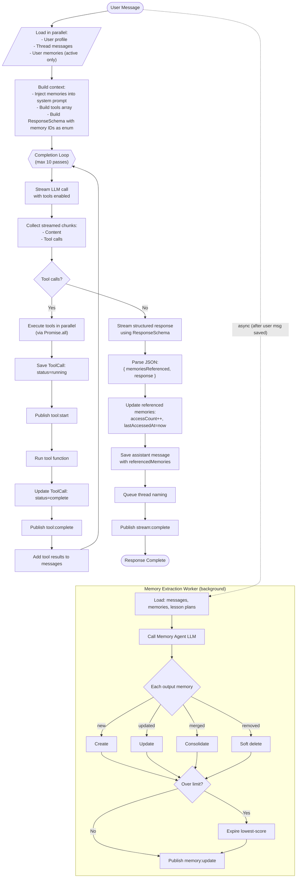

# Agent Completion Loop

The `createResponse` method in `src/core/agent.ts` implements an iterative agentic loop that handles tool calls and streams responses.

## Full Flow Diagram



## ResponseSchema with Memory ID Enum

The schema dynamically constrains `memoriesReferenced` to only valid memory IDs:

```typescript
// Memory IDs from DB become an enum constraint
const memoryIds = memories.map(m => m._id.toString());

const ResponseSchema = z.object({
  // LLM can ONLY return IDs that exist in the enum
  memoriesReferenced: z.array(
    z.enum(memoryIds as [string, ...string[]])
  ).describe("IDs of memories used in this response"),
  
  response: z.string().describe("The conversational reply")
});
```

**Why this matters:**
- Prevents hallucinated memory IDs — the LLM must choose from exact IDs in the system prompt
- Referenced IDs increment `accessCount`, which factors into the expiration score
- Memories with higher access counts survive longer during expiration

## Key Aspects

| Aspect | Implementation |
|--------|----------------|
| **Parallel loading** | User, messages, and memories fetched via `Promise.all` |
| **Dynamic schema** | Memory IDs injected as Zod enum at runtime |
| **Streaming** | All LLM calls use streaming to minimize TTFB |
| **Tool execution** | Multiple tools in one pass run via `Promise.all` |
| **Tool persistence** | Each tool call saved to DB with input/output/duration |
| **Structured output** | Final response uses `response_format` for reliable JSON |
| **Real-time updates** | Tokens stream to clients via Ably pub/sub |
| **Memory tracking** | Referenced memories get `accessCount++` for scoring |

## Memory Expiration Scoring

When a user exceeds the memory limit (default: 5), lowest-scoring memories are expired:

```
score = accessCount - (ageDays × 0.1)
```

- Higher access count → higher score → survives longer
- Older memories get a small penalty
- Memories referenced in responses naturally accumulate higher scores

