# System Architecture

## Overview

Next.js-based AI chatbot for creating middle school math lesson plans. Features real-time streaming via Ably, MongoDB persistence, Google OAuth authentication, and an intelligent memory system for context retention across sessions.

**Key Design**: Users, AI assistants, and service accounts are unified principals with consistent permissions — enabling scalable multi-agent systems without special cases.

## High-Level Architecture

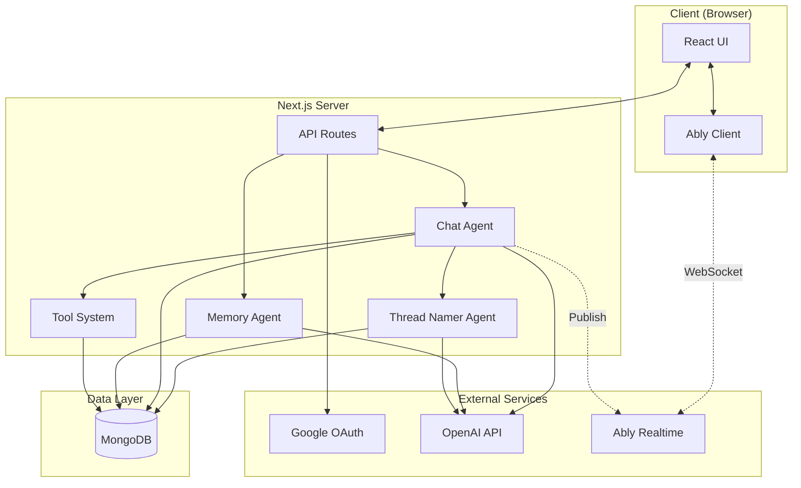

## Authentication Flow

Google OAuth 2.0 with server-side session management.

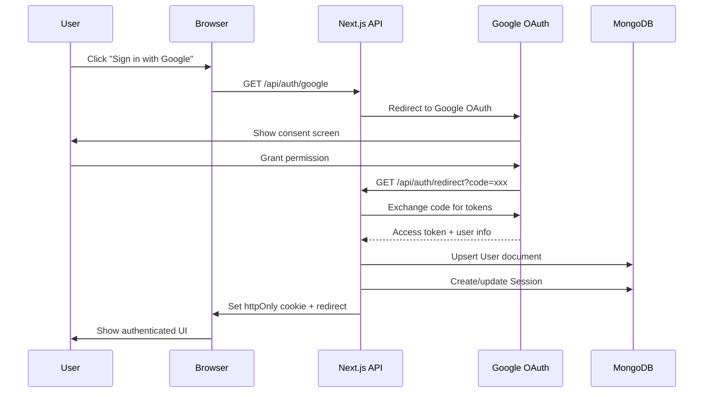

## Chat Message Flow

Real-time streaming architecture with background processing.

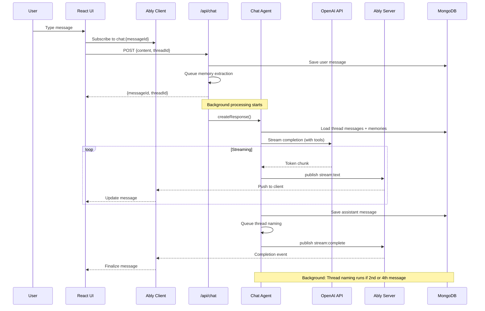

## Tool Execution Flow

The agent can call tools during response generation. Tools are executed in parallel when possible.

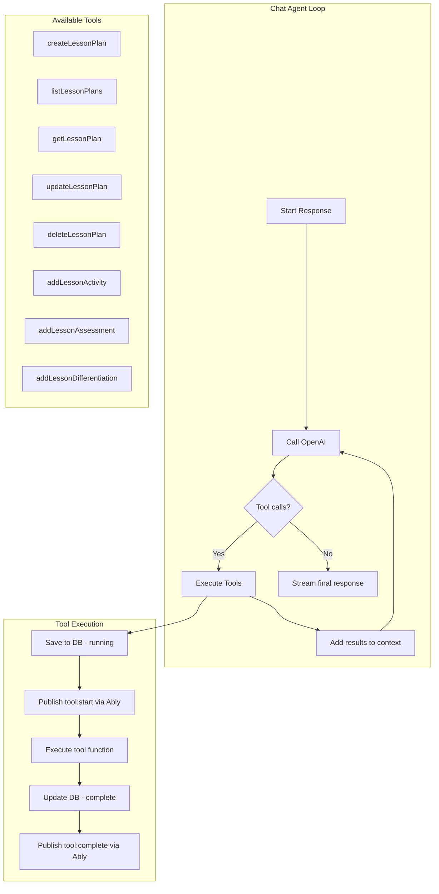

### Agent Completion Loop (Detailed)

See [AGENT-LOOP.md](./AGENT-LOOP.md) for the full diagram including tool execution, memory tracking, and background memory extraction.

## Background Workers

The system uses queue-based background workers for non-blocking post-processing.

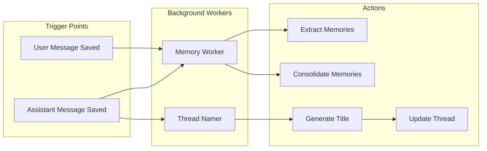

### Thread Namer Worker

Automatically generates descriptive titles for threads based on conversation content.

- **Triggers**: After 2nd message (first exchange) and 4th message (refined context)
- **Skip conditions**: Thread already has custom title, wrong message count
- **Model**: GPT-4o-mini (fast/cheap)
- **Output**: Title under 50 characters, topic-focused

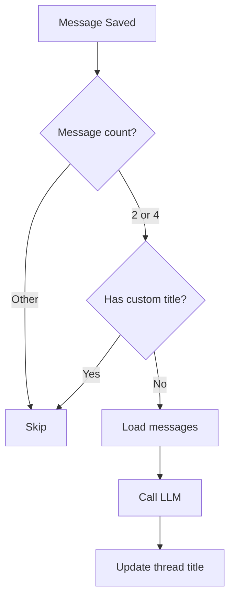

## Memory System

Intelligent memory extraction and consolidation for cross-session context.

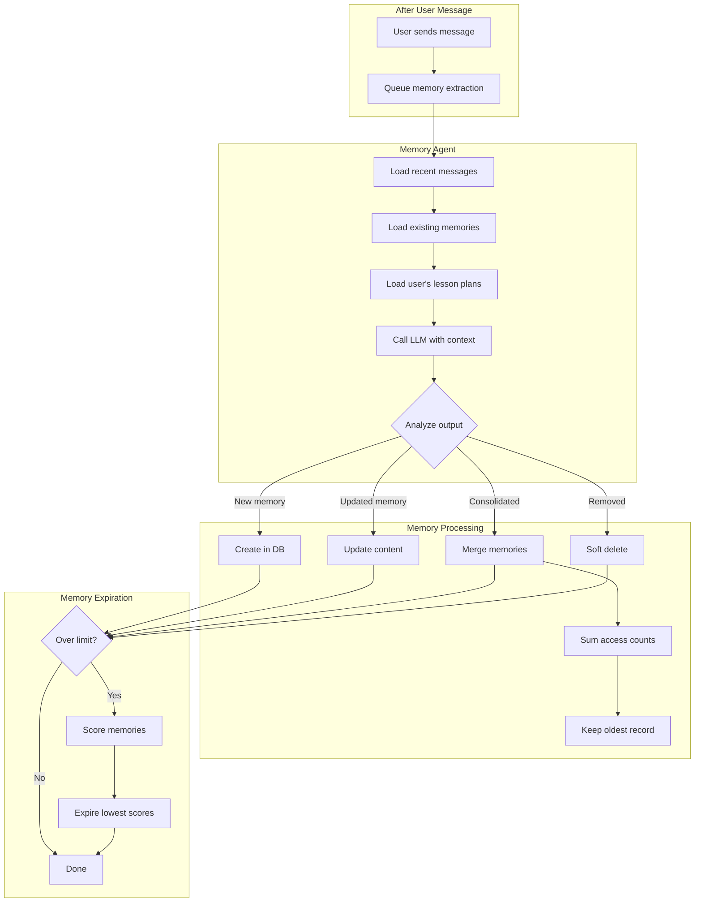

### Memory Lifecycle

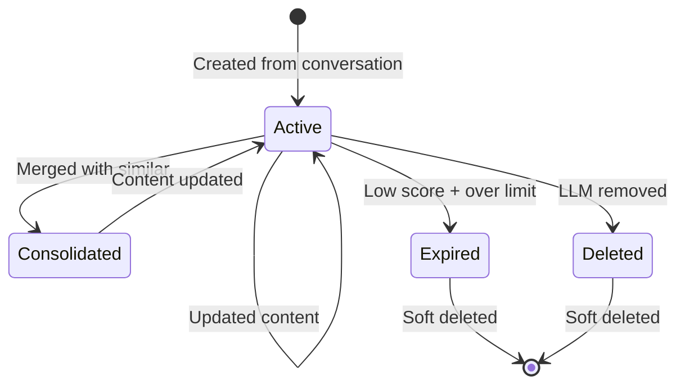

## Data Models

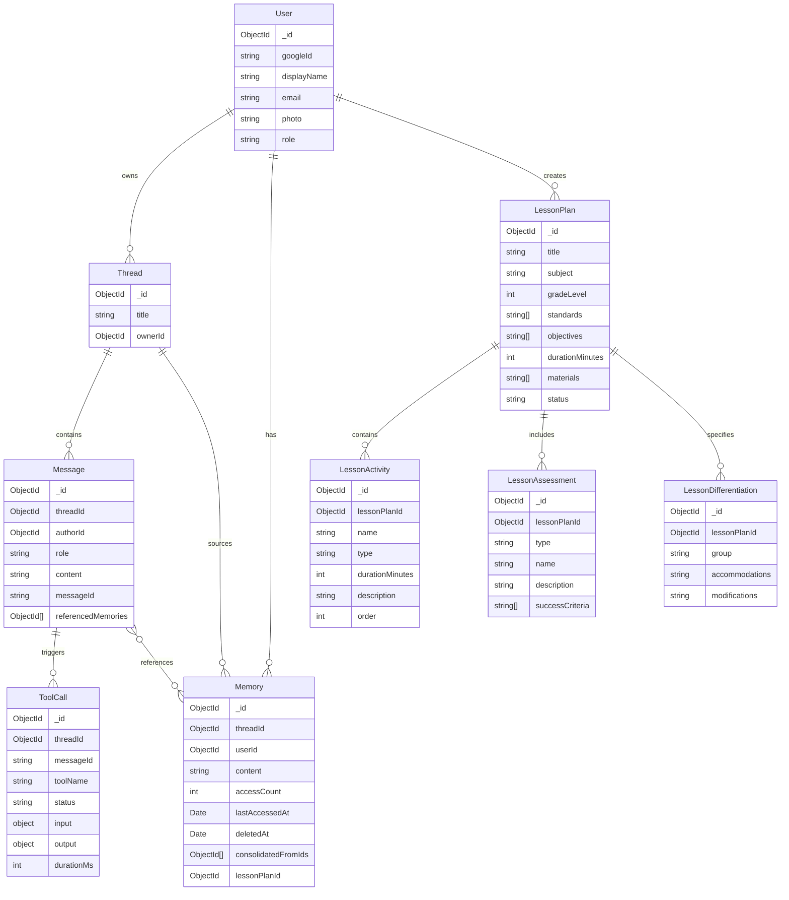

## Component Architecture

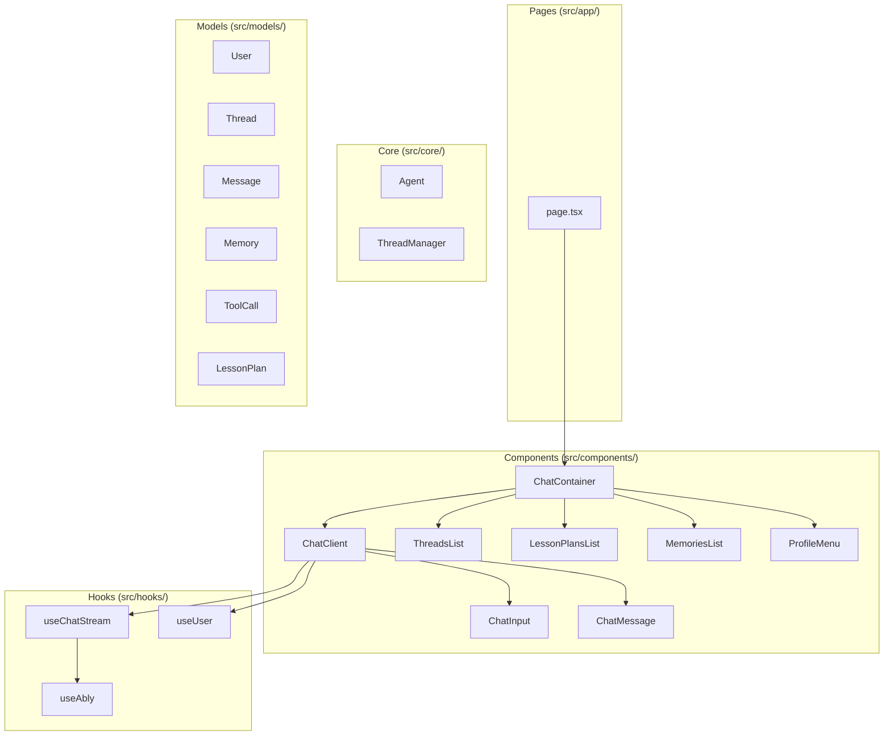

## API Routes

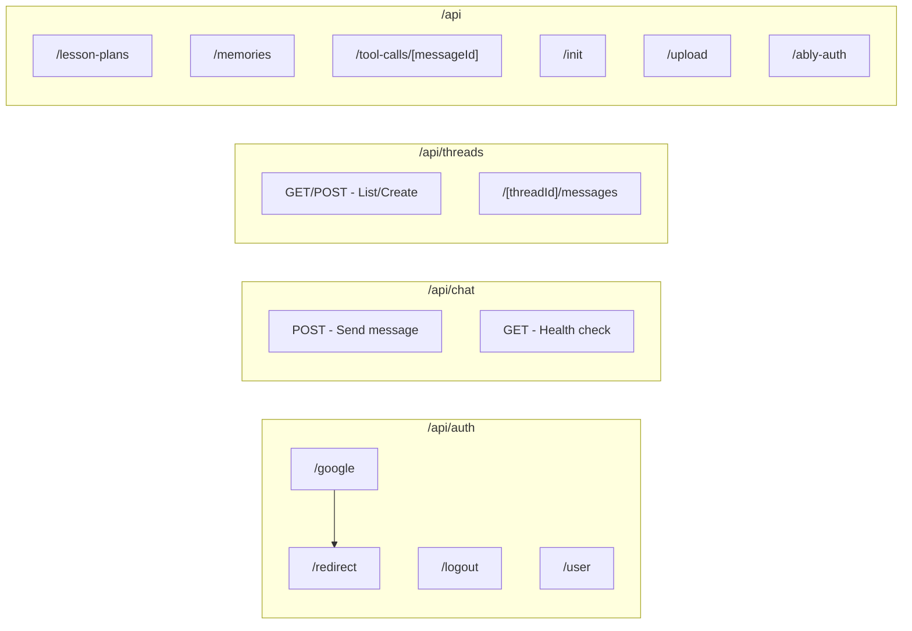

## Trade-offs

| Decision | Why | Alternative |
|----------|-----|-------------|
| Unified Principal Model | Scales to multi-agent without special logic | Separate AI/ServiceAccount models = duplicate permission systems |
| MongoDB | Flexible schema for evolving types, document model fits lesson plans | PostgreSQL = requires migrations for schema changes |
| Ably Streaming | Managed real-time, handles backpressure, reconnection | WebSockets = sticky sessions, manual reconnect logic |
| Cookie Sessions | Simple, server-controlled revocation | JWT = harder to revoke, larger payload |
| Background Streaming | Non-blocking HTTP response, better UX | Blocking = slow perceived response time |
| Soft Delete Memories | Audit trail, can show "used deleted memory" context | Hard delete = loses history |
| Memory Consolidation | Reduces redundancy, improves relevance | Keep all = context bloat over time |

## Future Extensions

- **Service Accounts**: Crawlers, processors, and automated agents
- **Multi-Agent Collaboration**: Multiple AI models working together
- **Team/Workspace Support**: Shared threads and lesson plans
- **Rate Limiting & Quotas**: Per-principal usage controls
- **RAG Integration**: Document retrieval for standards/curriculum context
- **Lesson Plan Export**: PDF/DOCX generation
- **Lesson Plan Sharing**: Public/private lesson plan library
